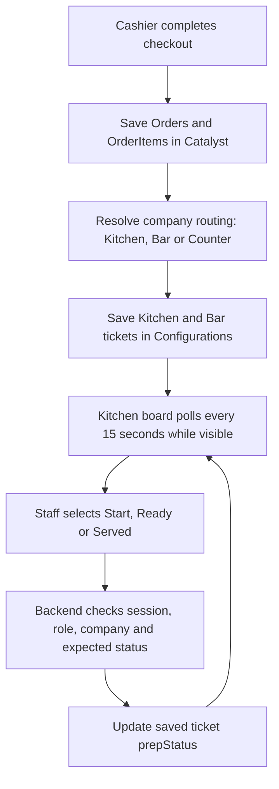

# Kitchen board

## Data flow and saved status

Kitchen preparation status is separate from the sales/payment status in `Orders`. Both routing and preparation tickets use the existing **Configurations** table; there is no dedicated KitchenTickets table.

| Record | `config_key` | `config_value` |
|---|---|---|
| Company routing | `org_<orgId>_setting_print_routing` | JSON category rules and `defaultStation` |
| Daily preparation tickets | `org_<orgId>_setting_kot_log_YYYY-MM-DD` | JSON array of tickets, including `number`, `orderId`, `station`, `items`, `prepStatus` and `prepUpdatedAt` |

`orgId` is the POS company ID from the signed-in session, not the Catalyst project/organization ID. The configured Development company is `94596000000235338`.

Each ticket starts with `prepStatus: QUEUED`. **Start** changes it to `PREPARING`, **Ready** to `READY`, and **Served** to `SERVED`. The status endpoint checks the expected current state before saving; stale clicks return 409. Served tickets leave the active rows and appear in history. Financial order status and printer status are not changed by these preparation actions.

The frontend calls `GET /api/kitchen/tickets` and `POST /api/kitchen/tickets/:number/status`. Product previews use the protected `GET /api/kitchen/tickets/:number/items/:index/image` endpoint. Backend API paths are mounted under `/server/pos_backend` on Catalyst.

## When there are 100 orders

One checkout can produce separate Kitchen and Bar tickets; Counter items produce none. With 100 new kitchen-routed orders, their tickets are saved in the daily configuration array and grouped by preparation stage. Each stage scrolls horizontally, with the oldest active tickets first. Other visible screens receive status changes at their next 15-second refresh.

Orders completed before kitchen routing was configured have no preparation ticket and do not appear automatically. Do not replay historical sales as new preparation work without checking whether they have already been served. The API currently reads today plus the previous six UTC days and the legacy KOT document, returning up to 200 active tickets and 50 finished tickets. Tickets outside that read window are not automatically displayed, even if still unfinished.

This JSON storage model is not a distributed queue: simultaneous writes across different function instances can overwrite one another, and a daily document can reach the configured column size limit. For sustained high-volume use, migrate to dedicated ticket rows and distributed concurrency control rather than assuming unlimited capacity.

## Access, layout and operations

New orders, ready orders and cancellations now feed the shared notification bell. Alert sounds can be enabled/muted from the bell or the kitchen toolbar. See [notification recipients, saved preferences and browser audio behavior](notifications-and-sounds.md).

Assign **Kitchen** in Administration → Users (invite a staff member or edit their role). Admins and the existing Chef compatibility role can also open **Kitchen → Kitchen board** at `/app/sales/kitchen`. Other roles cannot open the page or call its APIs. Kitchen staff have only the board and their personal profile in navigation.

In Settings → Print routing, route food categories to **Kitchen**, beverages to **Bar**, or set the appropriate default station. Counter-only items do not create preparation tickets. A physical kitchen printer is optional. Tickets are created after successful POS checkout; this does not add unpaid table tabs or send-to-kitchen before payment.

The Development company's default routing was configured to Kitchen on October 2, 2026. Previously no routing was saved, so all checkouts defaulted to Counter and generated no tickets. Checkout and routing settings now use server credentials after authentication, with the company key taken from the signed-in session. Routing/storage errors surface as a checkout warning rather than silently reporting kitchen delivery. Older counter-only sales do not have preparation tickets and are not automatically replayed.

Cashiers can expand **Table & kitchen notes** in the current order to enter a table/room and preparation instructions. The board shows dish quantities, notes, station, ticket/order numbers and minutes waiting. It excludes prices, payments, customer contacts and cashier identities.

The workflow is **Queued → Preparing → Ready → Served**. The oldest tickets appear first. Kitchen staff can filter by station, search dishes/tables, and review served/cancelled history. The board refreshes every 15 seconds while visible; tickets waiting at least 15 minutes are highlighted. Failed updates remain visible as errors. Stale state changes return 409 and refresh the board.

Queued, Preparing and Ready are three horizontal rows. Each row scrolls independently, with arrow buttons, keyboard focus and touch scrolling. Compact order cards show catalog images beside their dishes; missing/deleted images use a utensil placeholder. The board fills the viewport and keeps all three stages visible without vertical page scrolling. Long dish lists scroll sideways inside cards; Details opens the complete dishes and notes. Images use a protected ticket-item endpoint, without granting Kitchen staff catalog access. New tickets store the server-resolved product reference; older tickets resolve SKU images only within the current company.

The account icon shows the company logo for Admins and the saved personal profile photo for staff. Missing images fall back to the user's initial. Company logos use contain sizing and personal photos use cover sizing on both desktop and mobile.

Printer FIRED/ACKED/DONE states remain independent from preparation. Voids cancel unfinished preparation tickets; partial returns reduce affected dish quantities. These updates are best effort after the financial operation, so the counter should communicate cancellations directly if a datastore error occurs.

Existing KOT records without dish details display a warning and cannot start cooking. Admins can dismiss those legacy tickets after checking with the counter; dismissing does not void or refund a sale.

Storage reuses company-scoped daily KOT configuration documents and the existing seven-day read window. The API shows the oldest 200 active tickets plus the most recent 50 finished tickets. New daily writes retain unfinished tickets and the last 200 finished entries. Reads fail visibly on datastore errors. Server credentials are used only after session/role verification and all keys are bound to the session company.

Read-modify-write operations are serialized within one function instance. The shared configuration format has no cross-instance compare-and-swap guarantee; concurrent writes from different serverless instances can still race. This board uses the existing KOT storage model rather than introducing a new transactional ticket table. For high-volume multi-terminal use, migrate tickets to dedicated rows with distributed concurrency control.

Validation: backend workflow/permission/tenant tests and frontend role/navigation tests; desktop/mobile browser QA with a loopback-only fixture. Live staff sessions and actual checkout-to-kitchen routing require a signed-in restaurant account.
